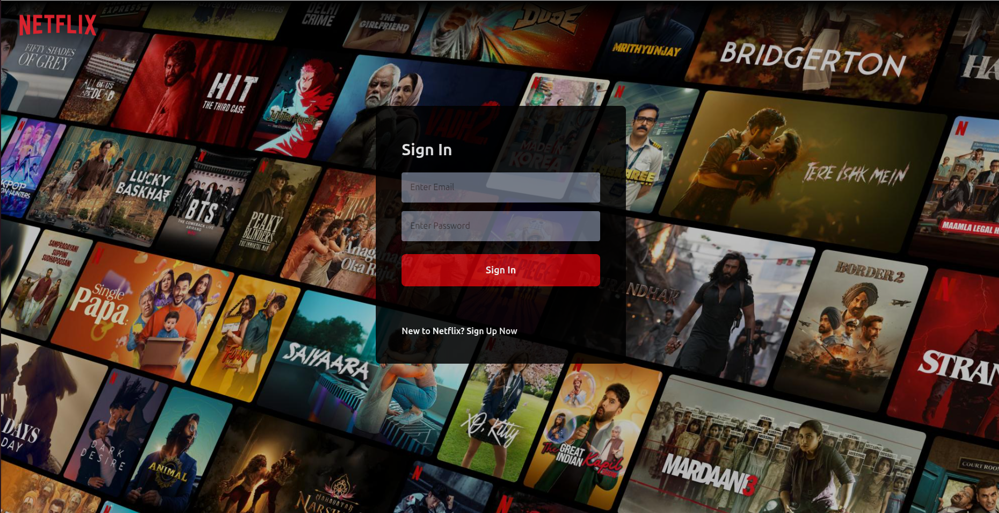
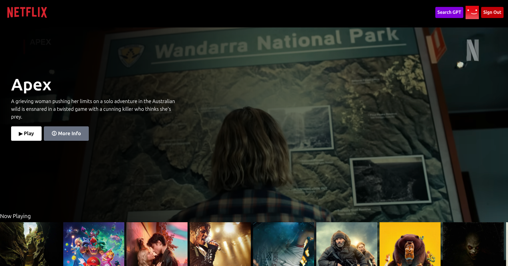
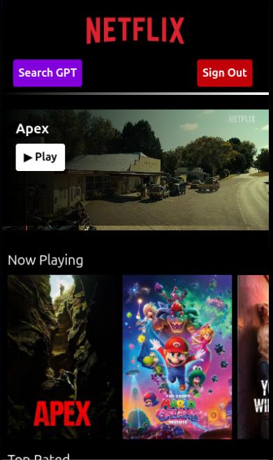
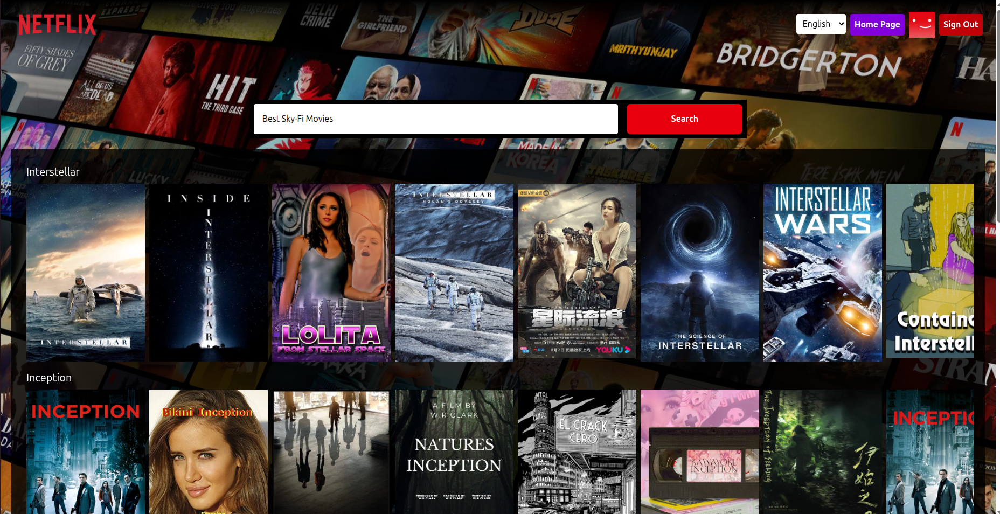
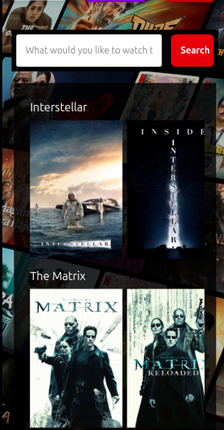
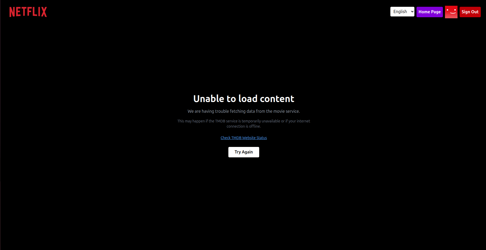

# 🎬 Netflix GPT – AI Movie Recommendation App

Netflix GPT is a modern movie discovery web application that combines TMDB movie data with OpenAI-powered search to provide intelligent movie recommendations. The app delivers a Netflix-like UI with smooth performance and responsive design.

---

## 🚀 Live Demo

https://gptflix-ai-by-rohit.netlify.app/

## 📂 GitHub Repository

https://github.com/MrRohitMI/netflix-gpt

---

## ✨ Features

### 🎬 Movie Browsing (TMDB API)

* 🎥 Display now playing movies
* 🖼️ Netflix-style hero banner
* 🎞️ Movie rows with horizontal scrolling
* 📱 Fully responsive UI

---

### 🤖 GPT Search (OpenAI Integration)

* 🔍 AI-powered movie recommendations
* 💡 Smart suggestions based on user input
* ⚡ Real-time search experience

---

### ⚡ Performance & UX

* 🔄 Shimmer UI for loading states
* 🚨 Netflix-style error handling
* ⚡ Lazy loading for optimized performance
* 📱 Mobile-first responsive design

---

## 🧠 Tech Stack

* ⚛️ React.js
* 🎨 Tailwind CSS
* 🔄 React Router DOM
* 🗃️ Redux Toolkit
* ⚡ Vite
* 🎬 TMDB API
* 🤖 OpenAI API
* 🔐 Firebase Authentication

---

## 📁 Project Structure

```id="c3u8be"
src/
 ├── components/
 ├── hooks/
 ├── utils/
 ├── App.jsx
 ├── main.jsx
```

---

## ⚙️ Setup Instructions

```bash id="s6r5h6"
git clone https://github.com/MrRohitMI/netflix-gpt.git
cd netflix-gpt
npm install
npm run dev
```

---

## 🔑 Environment Variables

Create a `.env` file and add:

```id="i06m39"
VITE_TMDB_API_KEY=your_tmdb_key
VITE_OPENAI_KEY=your_openai_key
```

---

## 🎯 Key Concepts Implemented

* API integration with TMDB and OpenAI
* State management using Redux Toolkit
* Error and loading state handling
* Reusable components and clean architecture

---

## 🚨 Error Handling

* Handles API failures gracefully
* Displays Netflix-style error UI
* Prevents UI crashes with fallback states

---

## 📸 Screenshots

| Login |
|------|
|  |
|------|
|  |
| Home |
|------|
|  |
|------|
|  |
| Search GPT |
|------|
|  |
|------|
|  |
| Error |
|------|
|  |
|------|
|  |


## 🔮 Future Improvements

* 🎯 Personalized recommendations
* ⭐ Watchlist / Favorites
* 🔍 Advanced filtering
* 🎬 Video previews

---

## 👨‍💻 Author

Rohit Mourya

* LinkedIn: https://www.linkedin.com/in/rohit-mourya/
* GitHub: https://github.com/MrRohitMI

---

## ⭐ Support

If you like this project, give it a ⭐ on GitHub!
